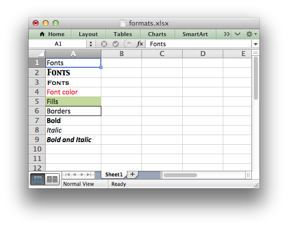
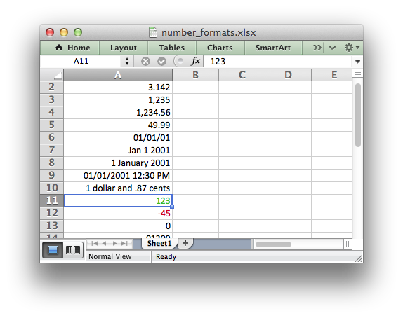
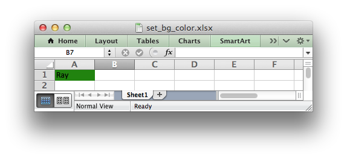

The Format Class {#format}
================

This section describes the methods and properties that are available for
formatting cells in Excel.

The properties of a cell that can be formatted include: fonts, colours,
patterns, borders, alignment and number formatting.

Format objects are created by calling the workbook `add_format()` method
as follows:

    format = workbook:add_format()

Format properties can be set by calling any of the methods shown in this
section:

    format = workbook:add_format()
    format:set_bold()
    format:set_font_color("red")

Alternatively the properties can be set by passing a table of properties
to the `add_format()`{.interpreted-text role="func"} constructor:

    format = workbook:add_format({bold = true, font_color = "red"})

The documentation below shows the property methods but the information
is equally applicable when using them in the
`add_format()`{.interpreted-text role="func"} constructor.

format:set\_font\_name()
------------------------

::: {.function}
set\_font\_name(fontname)

Set the font used in the cell.

param fontname

:   Cell font.
:::

Specify the font used used in the cell format:

    cell_format:set_font_name("Times New Roman")

Excel can only display fonts that are installed on the system that it is
running on. Therefore it is best to use the fonts that come as standard
such as \"Calibri\", \"Times New Roman\" and \"Courier New\".

The default font for an unformatted cell in Excel 2007+ is \"Calibri\".

format:set\_font\_size()
------------------------

::: {.function}
set\_font\_size(size)

Set the size of the font used in the cell.

param size

:   The cell font size.
:::

Set the font size of the cell format:

    format = workbook:add_format()
    format:set_font_size(30)

Excel adjusts the height of a row to accommodate the largest font size
in the row. You can also explicitly specify the height of a row using
the `set_row()`{.interpreted-text role="func"} worksheet method.

format:set\_font\_color()
-------------------------

::: {.function}
set\_font\_color(color)

Set the color of the font used in the cell.

param color

:   The cell font color.
:::

Set the font colour:

    format = workbook:add_format()

    format:set_font_color("red")

    worksheet:write(0, 0, "wheelbarrow", format)

The color can be a Html style `#RRGGBB` string or a limited number of
named colors, see `colors`{.interpreted-text role="ref"}.

Note: The `set_font_color()` method is used to set the colour of the
font in a cell. To set the colour of a cell use the
`set_bg_color()`{.interpreted-text role="func"} and
`set_pattern()`{.interpreted-text role="func"} methods.

format:set\_bold()
------------------

::: {.function}
set\_bold()

Turn on bold for the format font.
:::

Set the bold property of the font:

    format:set_bold()

format:set\_italic()
--------------------

::: {.function}
set\_italic()

Turn on italic for the format font.
:::

Set the italic property of the font:

    format:set_italic()

format:set\_underline()
-----------------------

::: {.function}
set\_underline()

Turn on underline for the format:

param style

:   Underline style.
:::

Set the underline property of the format:

    format:set_underline()

The available underline styles are:

-   1 = Single underline (the default)
-   2 = Double underline
-   33 = Single accounting underline
-   34 = Double accounting underline

format:set\_font\_strikeout()
-----------------------------

::: {.function}
set\_font\_strikeout()

Set the strikeout property of the font.
:::

format:set\_font\_script()
--------------------------

::: {.function}
set\_font\_script()

Set the superscript/subscript property of the font.
:::

The available options are:

-   1 = Superscript
-   2 = Subscript

format:set\_num\_format()
-------------------------

::: {.function}
set\_num\_format(format\_string)

Set the number format for a cell.

param format\_string

:   The cell number format:
:::

This method is used to define the numerical format of a number in Excel.
It controls whether a number is displayed as an integer, a floating
point number, a date, a currency value or some other user defined
format:

The numerical format of a cell can be specified by using a format string
or an index to one of Excel\'s built-in formats:

    format1 = workbook:add_format()
    format2 = workbook:add_format()

    format1:set_num_format("d mmm yyyy")  -- Format string.
    format2:set_num_format(0x0F)          -- Format index.

Format strings can control any aspect of number formatting allowed by
Excel:

    format01:set_num_format("0.000")
    worksheet:write(1, 0, 3.1415926, format01)       --> 3.142

    format02:set_num_format("#,##0")
    worksheet:write(2, 0, 1234.56, format02)         --> 1,235

    format03:set_num_format("#,##0.00")
    worksheet:write(3, 0, 1234.56, format03)         --> 1,234.56

    format04:set_num_format("0.00")
    worksheet:write(4, 0, 49.99, format04)           --> 49.99

    format05:set_num_format("mm/dd/yy")
    worksheet:write(5, 0, 36892.521, format05)       --> 01/01/01

    format06:set_num_format("mmm d yyyy")
    worksheet:write(6, 0, 36892.521, format06)       --> Jan 1 2001

    format07:set_num_format("d mmmm yyyy")
    worksheet:write(7, 0, 36892.521, format07)       --> 1 January 2001

    format08:set_num_format("dd/mm/yyyy hh:mm AM/PM")
    worksheet:write(8, 0, 36892.521, format08)       --> 01/01/2001 12:30 AM

    format09:set_num_format('0 "dollar and" .00 "cents"')
    worksheet:write(9, 0, 1.87, format09)            --> 1 dollar and .87 cents

    -- Conditional numerical formatting.
    format10:set_num_format("[Green]General;[Red]-General;General")
    worksheet:write(10, 0, 123, format10)  -- > 0 Green
    worksheet:write(11, 0, -45, format10)  -- < 0 Red
    worksheet:write(12, 0,   0, format10)  -- = 0 Default colour

    -- Zip code.
    format11:set_num_format("00000")
    worksheet:write(13, 0, 1209, format11)

The number system used for dates is described in
`working_with_dates_and_time`{.interpreted-text role="ref"}.

The colour format should have one of the following values:

    [Black] [Blue] [Cyan] [Green] [Magenta] [Red] [White] [Yellow]

For more information refer to the [Microsoft documentation on cell
formats](http://office.microsoft.com/en-gb/assistance/HP051995001033.aspx).

Excel\'s built-in formats are shown in the following table:

  -----------------------------------------------------------------------
  Index   Index   Format String
  ------- ------- -------------------------------------------------------
  0       0x00    `General`

  1       0x01    `0`

  2       0x02    `0.00`

  3       0x03    `#,##0`

  4       0x04    `#,##0.00`

  5       0x05    `($#,##0_);($#,##0)`

  6       0x06    `($#,##0_);[Red]($#,##0)`

  7       0x07    `($#,##0.00_);($#,##0.00)`

  8       0x08    `($#,##0.00_);[Red]($#,##0.00)`

  9       0x09    `0%`

  10      0x0a    `0.00%`

  11      0x0b    `0.00E+00`

  12      0x0c    `# ?/?`

  13      0x0d    `# ??/??`

  14      0x0e    `m/d/yy`

  15      0x0f    `d-mmm-yy`

  16      0x10    `d-mmm`

  17      0x11    `mmm-yy`

  18      0x12    `h:mm AM/PM`

  19      0x13    `h:mm:ss AM/PM`

  20      0x14    `h:mm`

  21      0x15    `h:mm:ss`

  22      0x16    `m/d/yy h:mm`

  \...    \...    \...

  37      0x25    `(#,##0_);(#,##0)`

  38      0x26    `(#,##0_);[Red](#,##0)`

  39      0x27    `(#,##0.00_);(#,##0.00)`

  40      0x28    `(#,##0.00_);[Red](#,##0.00)`

  41      0x29    `_(* #,##0_);_(* (#,##0);_(* "-"_);_(@_)`

  42      0x2a    `_($* #,##0_);_($* (#,##0);_($* "-"_);_(@_)`

  43      0x2b    `_(* #,##0.00_);_(* (#,##0.00);_(* "-"??_);_(@_)`

  44      0x2c    `_($* #,##0.00_);_($* (#,##0.00);_($* "-"??_);_(@_)`

  45      0x2d    `mm:ss`

  46      0x2e    `[h]:mm:ss`

  47      0x2f    `mm:ss.0`

  48      0x30    `##0.0E+0`

  49      0x31    `@`
  -----------------------------------------------------------------------

::: {.note}
::: {.title}
Note
:::

Numeric formats 23 to 36 are not documented by Microsoft and may differ
in international versions. The listed date and currency formats may also
vary depending on system settings.
:::

::: {.note}
::: {.title}
Note
:::

The dollar sign in the above formats appear as the defined local
currency symbol.
:::

format:set\_locked()
--------------------

::: {.function}
set\_locked(state)

Set the cell locked state.

param bool state

:   Turn cell locking on or off. Defaults to true.
:::

This property can be used to prevent modification of a cells contents.
Following Excel\'s convention, cell locking is turned on by default.
However, it only has an effect if the worksheet has been protected using
the worksheet `protect()`{.interpreted-text role="func"} method:

    locked = workbook:add_format()
    locked:set_locked(true)

    unlocked = workbook:add_format()
    locked:set_locked(false)

    -- Enable worksheet protection
    worksheet:protect()

    -- This cell cannot be edited.
    worksheet:write("A1", "=1+2", locked)

    -- This cell can be edited.
    worksheet:write("A2", "=1+2", unlocked)

format:set\_hidden()
--------------------

::: {.function}
set\_hidden()

Hide formulas in a cell.
:::

This property is used to hide a formula while still displaying its
result. This is generally used to hide complex calculations from end
users who are only interested in the result. It only has an effect if
the worksheet has been protected using the worksheet
`protect()`{.interpreted-text role="func"} method:

    hidden = workbook:add_format()
    hidden:set_hidden()

    -- Enable worksheet protection
    worksheet:protect()

    -- The formula in this cell isn't visible
    worksheet:write("A1", "=1+2", hidden)

format:set\_align()
-------------------

::: {.function}
set\_align(alignment)

Set the alignment for data in the cell.

param alignment

:   The vertical and or horizontal alignment direction.
:::

This method is used to set the horizontal and vertical text alignment
within a cell. The following are the available horizontal alignments:

  ----------------------
  Horizontal alignment
  ----------------------
  center

  right

  fill

  justify

  center\_across
  ----------------------

The following are the available vertical alignments:

  --------------------
  Vertical alignment
  --------------------
  top

  vcenter

  bottom

  vjustify
  --------------------

As in Excel, vertical and horizontal alignments can be combined:

    format = workbook:add_format()

    format:set_align("center")
    format:set_align("vcenter")

    worksheet:set_row(0, 30)
    worksheet:write(0, 0, "Some Text", format)

Text can be aligned across two or more adjacent cells using the
`"center_across"` property. However, for genuine merged cells it is
better to use the `merge_range()` worksheet method.

The `"vjustify"` (vertical justify) option can be used to provide
automatic text wrapping in a cell. The height of the cell will be
adjusted to accommodate the wrapped text. To specify where the text
wraps use the `set_text_wrap()` method.

format:set\_center\_across()
----------------------------

::: {.function}
set\_center\_across()

Centre text across adjacent cells.
:::

Text can be aligned across two or more adjacent cells using the
`set_center_across()` method. This is an alias for the
`set_align("center_across")` method call.

Only one cell should contain the text, the other cells should be blank:

    format = workbook:add_format()
    format:set_center_across()

    worksheet:write(1, 1, "Center across selection", format)
    worksheet:write_blank(1, 2, format)

For actual merged cells it is better to use the `merge_range()`
worksheet method.

format:set\_text\_wrap()
------------------------

::: {.function}
set\_text\_wrap()

Wrap text in a cell.
:::

Turn text wrapping on for text in a cell:

    format = workbook:add_format()
    format:set_text_wrap()

    worksheet:write(0, 0, "Some long text to wrap in a cell", format)

If you wish to control where the text is wrapped you can add newline
characters to the string:

    format = workbook:add_format()
    format:set_text_wrap()

    worksheet:write(0, 0, "It's\na bum\nwrap", format)

Excel will adjust the height of the row to accommodate the wrapped text.
A similar effect can be obtained without newlines using the
`set_align("vjustify")` method.

format:set\_rotation()
----------------------

::: {.function}
set\_rotation(angle)

Set the rotation of the text in a cell.

param angle

:   Rotation angle in the range -90 to 90 and 270.
:::

Set the rotation of the text in a cell. The rotation can be any angle in
the range -90 to 90 degrees:

    format = workbook:add_format()
    format:set_rotation(30)

    worksheet:write(0, 0, "This text is rotated", format)

The angle 270 is also supported. This indicates text where the letters
run from top to bottom.

format:set\_indent()
--------------------

::: {.function}
set\_indent(level)

Set the cell text indentation level.

param level

:   Indentation level.
:::

This method can be used to indent text in a cell. The argument, which
should be an integer, is taken as the level of indentation:

    format1 = workbook:add_format()
    format2 = workbook:add_format()

    format1:set_indent(1)
    format2:set_indent(2)

    worksheet:write("A1", "This text is indented 1 level",  format1)
    worksheet:write("A2", "This text is indented 2 levels", format2)

Indentation is a horizontal alignment property. It will override any
other horizontal properties but it can be used in conjunction with
vertical properties.

format:set\_shrink()
--------------------

::: {.function}
set\_shrink()

Turn on the text \"shrink to fit\" for a cell.
:::

This method can be used to shrink text so that it fits in a cell:

    format = workbook:add_format()
    format:set_shrink()

    worksheet:write(0, 0, "Honey, I shrunk the text!", format)

format:set\_text\_justlast()
----------------------------

::: {.function}
set\_text\_justlast()

Turn on the \"justify last\" text property.
:::

Only applies to Far Eastern versions of Excel.

format:set\_pattern()
---------------------

::: {.function}
set\_pattern(index)

param index

:   Pattern index. 0 - 18.
:::

Set the background pattern of a cell.

The most common pattern is 1 which is a solid fill of the background
color.

format:set\_bg\_color()
-----------------------

::: {.function}
set\_bg\_color(color)

Set the color of the background pattern in a cell.

param color

:   The cell font color.
:::

The `set_bg_color()` method can be used to set the background colour of
a pattern. Patterns are defined via the `set_pattern()` method. If a
pattern hasn\'t been defined then a solid fill pattern is used as the
default.

Here is an example of how to set up a solid fill in a cell:

    format = workbook:add_format()

    format:set_pattern(1)  -- This is optional when using a solid fill.
    format:set_bg_color("green")

    worksheet:write("A1", "Ray", format)

The color can be a Html style `#RRGGBB` string or a limited number of
named colors, see `colors`{.interpreted-text role="ref"}.

format:set\_fg\_color()
-----------------------

::: {.function}
set\_fg\_color(color)

Set the color of the foreground pattern in a cell.

param color

:   The cell font color.
:::

The `set_fg_color()` method can be used to set the foreground colour of
a pattern.

The color can be a Html style `#RRGGBB` string or a limited number of
named colors, see `colors`{.interpreted-text role="ref"}.

format:set\_border()
--------------------

::: {.function}
set\_border(style)

Set the cell border style.

param style

:   Border style index. Default is 1.
:::

Individual border elements can be configured using the following methods
with the same parameters:

-   `set_bottom()`{.interpreted-text role="func"}
-   `set_top()`{.interpreted-text role="func"}
-   `set_left()`{.interpreted-text role="func"}
-   `set_right()`{.interpreted-text role="func"}

A cell border is comprised of a border on the bottom, top, left and
right. These can be set to the same value using `set_border()` or
individually using the relevant method calls shown above.

The following shows the border styles sorted by Excel index number:

  --------------------------------------------------
  Index   Name            Weight   Style
  ------- --------------- -------- -----------------
  0       None            0

  1       Continuous      1        `-----------`

  2       Continuous      2        `-----------`

  3       Dash            1        `- - - - - -`

  4       Dot             1        `. . . . . .`

  5       Continuous      3        `-----------`

  6       Double          3        `===========`

  7       Continuous      0        `-----------`

  8       Dash            2        `- - - - - -`

  9       Dash Dot        1        `- . - . - .`

  10      Dash Dot        2        `- . - . - .`

  11      Dash Dot Dot    1        `- . . - . .`

  12      Dash Dot Dot    2        `- . . - . .`

  13      SlantDash Dot   2        `/ - . / - .`
  --------------------------------------------------

The following shows the borders in the order shown in the Excel Dialog:

  ---------------------------------------------------
  Index   Style             Index   Style
  ------- ----------------- ------- -----------------
  0       None              12      `- . . - . .`

  7       `-----------`     13      `/ - . / - .`

  4       `. . . . . .`     10      `- . - . - .`

  11      `- . . - . .`     8       `- - - - - -`

  9       `- . - . - .`     2       `-----------`

  3       `- - - - - -`     5       `-----------`

  1       `-----------`     6       `===========`
  ---------------------------------------------------

format:set\_bottom()
--------------------

::: {.function}
set\_bottom(style)

Set the cell bottom border style.

param style

:   Border style index. Default is 1.
:::

Set the cell bottom border style. See `set_border`{.interpreted-text
role="func"} for details on the border styles.

format:set\_top()
-----------------

::: {.function}
set\_top(style)

Set the cell top border style.

param style

:   Border style index. Default is 1.
:::

Set the cell top border style. See `set_border`{.interpreted-text
role="func"} for details on the border styles.

format:set\_left()
------------------

::: {.function}
set\_left(style)

Set the cell left border style.

param style

:   Border style index. Default is 1.
:::

Set the cell left border style. See `set_border`{.interpreted-text
role="func"} for details on the border styles.

format:set\_right()
-------------------

::: {.function}
set\_right(style)

Set the cell right border style.

param style

:   Border style index. Default is 1.
:::

Set the cell right border style. See `set_border`{.interpreted-text
role="func"} for details on the border styles.

format:set\_border\_color()
---------------------------

::: {.function}
set\_border\_color(color)

Set the color of the cell border.

param color

:   The cell border color.
:::

Individual border elements can be configured using the following methods
with the same parameters:

-   `set_bottom_color()`{.interpreted-text role="func"}
-   `set_top_color()`{.interpreted-text role="func"}
-   `set_left_color()`{.interpreted-text role="func"}
-   `set_right_color()`{.interpreted-text role="func"}

Set the colour of the cell borders. A cell border is comprised of a
border on the bottom, top, left and right. These can be set to the same
colour using `set_border_color()` or individually using the relevant
method calls shown above.

The color can be a Html style `#RRGGBB` string or a limited number of
named colors, see `colors`{.interpreted-text role="ref"}.

format:set\_bottom\_color()
---------------------------

::: {.function}
set\_bottom\_color(color)

Set the color of the bottom cell border.

param color

:   The cell border color.
:::

See `set_border_color`{.interpreted-text role="func"} for details on the
border colors.

format:set\_top\_color()
------------------------

::: {.function}
set\_top\_color(color)

Set the color of the top cell border.

param color

:   The cell border color.
:::

See `set_border_color`{.interpreted-text role="func"} for details on the
border colors.

format:set\_left\_color()
-------------------------

::: {.function}
set\_left\_color(color)

Set the color of the left cell border.

param color

:   The cell border color.
:::

See `set_border_color`{.interpreted-text role="func"} for details on the
border colors.

format:set\_right\_color()
--------------------------

::: {.function}
set\_right\_color(color)

Set the color of the right cell border.

param color

:   The cell border color.
:::

See `set_border_color`{.interpreted-text role="func"} for details on the
border colors.
