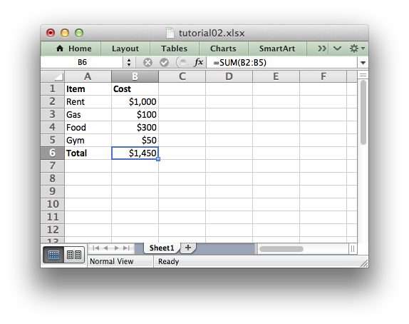

Tutorial 2: Adding formatting to the XLSX File {#tutorial2}
==============================================

In the previous section we created a simple spreadsheet using Lua and
the `xlsxwriter` module.

This converted the required data into an Excel file but it looked a
little bare. In order to make the information clearer we would like to
add some simple formatting, like this:



The differences here are that we have added **Item** and **Cost** column
headers in a bold font, we have formatted the currency in the second
column and we have made the **Total** string bold.

To do this we can extend our program as follows:

::: {.only}
html

(The significant changes are shown with a red line.)
:::

``` {.lua}
local Workbook = require "xlsxwriter.workbook"


-- Create a workbook and add a worksheet.
local workbook  = Workbook:new("Expensese02.xlsx")
local worksheet = workbook:add_worksheet()

-- Add a bold format to use to highlight cells.
local bold = workbook:add_format({bold = true})

-- Add a number format for cells with money.
local money = workbook:add_format({num_format = "$#,##0"})

-- Write some data header.
worksheet:write("A1", "Item", bold)
worksheet:write("B1", "Cost", bold)

-- Some data we want to write to the worksheet.
local expenses = {
  {"Rent", 1000},
  {"Gas",   100},
  {"Food",  300},
  {"Gym",    50},
}

-- Start from the first cell below the headers.
local row = 1
local col = 0

-- Iterate over the data and write it out element by element.
for _, expense in ipairs(expenses) do
  local item, cost = unpack(expense)
  worksheet:write(row, col,     item)
  worksheet:write(row, col + 1, cost, money)
  row = row + 1
end

-- Write a total using a formula.
worksheet:write(row, 0, "Total",       bold)
worksheet:write(row, 1, "=SUM(B2:B5)", money)

workbook:close()
```

The main difference between this and the previous program is that we
have added two `Format <Format>`{.interpreted-text role="ref"} objects
that we can use to format cells in the spreadsheet.

Format objects represent all of the formatting properties that can be
applied to a cell in Excel such as fonts, number formatting, colors and
borders. This is explained in more detail in `format`{.interpreted-text
role="ref"} and `working_with_formats`{.interpreted-text role="ref"}.

For now we will avoid getting into the details and just use a limited
amount of the format functionality to add some simple formatting:

    -- Add a bold format to use to highlight cells.
    local bold = workbook:add_format({bold = true})

    -- Add a number format for cells with money.
    local money = workbook:add_format({num_format = "$#,##0"})

We can then pass these formats as an optional third parameter to the
`worksheet. <Worksheet>`{.interpreted-text
role="ref"}`write()`{.interpreted-text role="func"} method to format the
data in the cell:

    write(row, column, token, [format])

Like this:

    worksheet:write(row, 0, "Total", bold)

Which leads us to another new feature in this program. To add the
headers in the first row of the worksheet we used
`write()`{.interpreted-text role="func"} like this:

    worksheet:write("A1", "Item", bold)
    worksheet:write("B1", "Cost", bold)

So, instead of `(row, col)` we used the Excel `"A1"` style notation. See
`cell_notation`{.interpreted-text role="ref"} for more details but
don\'t be too concerned about it for now. It is just a little syntactic
sugar to help with laying out worksheets.

In the next section we will look at handling more data types.
