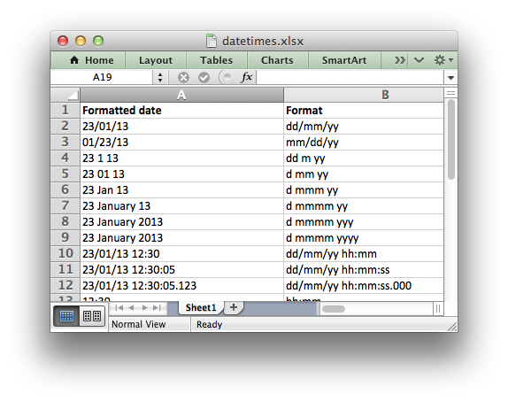

Working with Dates and Time {#working_with_dates_and_time}
===========================

Dates and times in Excel are represented by real numbers. For example a
date that is displayed in Excel as \"Jan 1 2013 12:00 PM\" is stored as
the number 41275.5.

The integer part of the number stores the number of days since the
epoch, which is generally 1900, and the fractional part stores the
percentage of the day.

A date or time in Excel is just like any other number. To display the
number as a date you must apply an Excel number format to it. Here are
some examples:

``` {.lua}
local Workbook = require "xlsxwriter.workbook"

local workbook  = Workbook:new("date_examples.xlsx")
local worksheet = workbook:add_worksheet()

-- Widen the first column or extra visibility.
worksheet:set_column("A:A", 30)

-- A number to convert to a date.
local number = 41333.5

-- Write it as a number without formatting.
worksheet:write("A1", number)          --> 41333.5

local format2 = workbook:add_format({num_format = "dd/mm/yy"})
worksheet:write("A2", number, format2) --> 28/02/13

local format3 = workbook:add_format({num_format = "mm/dd/yy"})
worksheet:write("A3", number, format3) --> 02/28/13

local format4 = workbook:add_format({num_format = "d-m-yyyy"})
worksheet:write("A4", number, format4) --> 28-2-2013

local format5 = workbook:add_format({num_format = "dd/mm/yy hh:mm"})
worksheet:write("A5", number, format5) --> 28/02/13 12:00

local format6 = workbook:add_format({num_format = "d mmm yyyy"})
worksheet:write("A6", number, format6) --> 28 Feb 2013

local format7 = workbook:add_format({num_format = "mmm d yyyy hh:mm AM/PM"})
worksheet:write("A7", number, format7) --> Feb 28 2008 12:00 PM

workbook:close()
```


To make working with dates and times a little easier the `xlsxwriter`
module provides two date handling methods:
`write_date_time`{.interpreted-text role="func"} and
`write_date_string`{.interpreted-text role="func"}.

The `write_date_time`{.interpreted-text role="func"} method takes a
table of values like those used for
[os.time()](http://www.lua.org/manual/5.2/manual.html#pdf-os.time) :

    date_format = workbook:add_format({num_format = "d mmmm yyyy"})

    worksheet:write_date_time("A1", {year = 2014, month = 3, day = 17}, date_format)

The allowable table keys and values are:

  -----------------------
  Key      Value
  -------- --------------
  year     4 digit year

  month    1 - 12

  day      1 - 31

  hour     0 - 23

  min      0 - 59

  sec      0 - 59.999
  -----------------------

The `write_date_string`{.interpreted-text role="func"} method takes a
string in an ISO8601 format:

    yyyy-mm-ddThh:mm:ss.sss

This conforms to an ISO8601 date but it should be noted that the full
range of ISO8601 formats are not supported. The following variations are
permitted:

    yyyy-mm-ddThh:mm:ss.sss         -- Standard format.
    yyyy-mm-ddThh:mm:ss.sssZ        -- Additional Z (but not time zones).
    yyyy-mm-dd                      -- Date only, no time.
               hh:mm:ss.sss         -- Time only, no date.
               hh:mm:ss             -- No fractional seconds.

Note that the T is required for cases with both date, and time and
seconds are required for all times.

Here is an example using `write_date_string()`:

    date_format = workbook:add_format({num_format = "d mmmm yyyy"})

    worksheet:write_date_string("A1", "2014-03-17", date_format)

Here is a longer example that displays the same date in a several
different formats:

``` {.lua}
local Workbook = require "xlsxwriter.workbook"

local workbook  = Workbook:new("datetimes.xlsx")
local worksheet = workbook:add_worksheet()
local bold      = workbook:add_format({bold = true})

-- Expand the first columns so that the date is visible.
worksheet:set_column("A:B", 30)

-- Write the column headers.
worksheet:write("A1", "Formatted date", bold)
worksheet:write("B1", "Format",         bold)

-- Create an ISO8601 style date string to use in the examples.
local date_string = "2013-01-23T12:30:05.123"

-- Examples date and time formats. In the output file compare how changing
-- the format codes change the appearance of the date.
local date_formats = {
  "dd/mm/yy",
  "mm/dd/yy",
  "dd m yy",
  "d mm yy",
  "d mmm yy",
  "d mmmm yy",
  "d mmmm yyy",
  "d mmmm yyyy",
  "dd/mm/yy hh:mm",
  "dd/mm/yy hh:mm:ss",
  "dd/mm/yy hh:mm:ss.000",
  "hh:mm",
  "hh:mm:ss",
  "hh:mm:ss.000",
}

-- Write the same date and time using each of the above formats.
for row, date_format_str in ipairs(date_formats) do

  -- Create a format for the date or time.
  local date_format = workbook:add_format({num_format = date_format_str,
                                           align = "left"})

  -- Write the same date using different formats.
  worksheet:write_date_string(row, 0, date_string, date_format)

  -- Also write the format string for comparison.
  worksheet:write_string(row, 1, date_format_str)

end

workbook:close()
```


